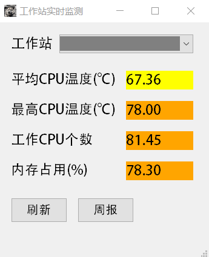
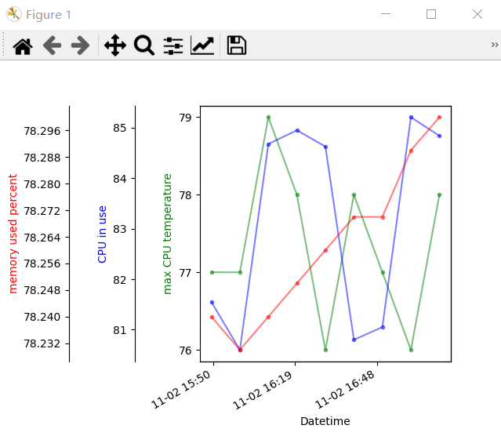

# AutoSensors

轻量级工作站运维

### 功能

- 自动运行`sensors`指令监测工作站状态，懒癌福音。
- 当工作站超负荷运行时自动弹窗告警。
- 保存2周的工作站状态记录。
- 易操作的GUI界面。

### 环境要求

监控端（Windows）：Python 3.9+
工作站（Linux）：Python 3.6+
工作站须能够使用`sensors`指令。

### 安装

监控端：
1. 请移步Release页面下载可执行文件`gui.exe`。
2. 下载`config.json`并填入必要的设置。参见**设置**章节。
3. 在XShell中导出RSA私钥文件，例如`your.key`。
4. 启动监控端之前，你的文件夹包含3个文件：`gui.exe`，`config.json`，`your.key`。

工作站：
1. 复制仓库。只需要Python脚本，不需要`assets`文件夹。
2. 确保已经安装了必要的Python库，如缺，pip一下。
3. `nohup python3 mainlocal.py &`后台启动脚本。
4. 输入`top`指令，可以发现这个监控程序的进程名是`monitor`。

### 运行

#### 监控端

配置稳妥后，打开`gui.exe`，此时程序自动进入系统托盘，每**1分钟**通过SSH发送一次`sensors`，`free -m`，`top`指令。监控端将静默运行，当CPU温度/风扇转速/CPU占用/内存占用/交换内存占用达到一定值时告警。

程序启动时，会自动通过SFTP协议拉取工作站状态记录文件。

点击系统托盘图标可以打开GUI界面。界面一般如下：

- 点击下拉框可更换监控的工作站。
- 点击“刷新”立即更新数据。
- 点击“周报”重新拉取记录文件，并显示分析界面，如图所示：

**注意** 生成周报至少需要4条数据，也就是工作站端启动`mainlocal.py`至少40分钟后才能查看，否则将导致监控端程序卡死。

点击窗口退出键不会退出监控端，只是最小化到系统托盘。要关闭监控端，请右键系统托盘图标，点击“退出”。

#### 工作站

`mainlocal.py`每**10分钟**记录一次工作站状态，保留最近2周的记录并循环覆盖。记录文件默认输出到`log.txt`。记录文件约500 KB。程序专门为写入数据做了优化，不会重写整个文件，因此不必担心频繁读写损伤硬盘。

### 设置

`config.json`选项列表：

`hosts: list` - 主机IP地址和端口号，可以添加多个主机。
`username: str` - 你用来登陆工作站的用户名。
`key_file: str` - RSA私钥文件路径。
`key_password: str` - RAS私钥文件的密码。
`remote_log_path: str` - 工作站运行`mainlocal.py`生成的`log.txt`所在的路径。如果不想在工作站运行自动监控程序，此项填`null`。
`local_log_path: str` - 拉取工作站状态记录时，下载的文件的路径。
`message_box: bool` - `true`弹出小窗口显示信息和告警。`false`使用Windows 10通知消息显示信息和告警。（如果选择此项，请确保`gui.exe`所在的文件夹有权限发送通知消息，否则收不到告警）
`high_temp_rate: float` - 当前最高CPU温度超过`sensors`规定的high temperature多少倍时告警。
`high_fan_rate: float` - 当前风扇转速超过`sensors`规定的max fan多少倍时告警。
`high_cpu_rate: float` - 当CPU总占用率达到多少时告警。
`high_memory_rate: float` - 当内存总占用率达到多少时告警。
